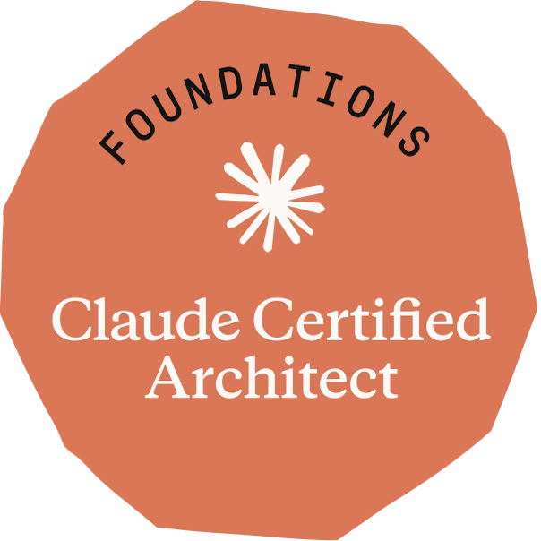

# Oscar Torres

### Software engineer building AI products end to end.

**Full stack · AI &amp; LLM systems · React &amp; TypeScript**

 

**Claude Certified Architect · Foundations**
Anthropic, 2026 · [verify&nbsp;→](https://www.credly.com/badges/71b73ba9-bdb6-48e8-b108-aea77c3628c5)

---

## About

Senior Software Engineer with 6+ years shipping high-performance React applications and, more recently, AI-powered systems. I care about frontend architecture, design systems, and performance, and I like owning the whole thing from design tokens to serverless backends.

I do my best work building shared tooling that lifts an entire team: component libraries, microfrontend platforms, and the kind of testing and docs that make onboarding painless.

## Now

Senior Software Engineer at **Starbucks**, modernizing the React applications behind [starbucks.com](https://starbucks.com) and the US Rewards experience: framework upgrades, new features, and incremental migration of legacy code with a focus on production stability.

## Selected work

Side projects running in production, with real users and real numbers.

| Project | What it is | Impact |
| --- | --- | --- |
| **[Autolisto Appointments](https://appointments-autolisto.vercel.app)** | Full-stack scheduling and operations platform with role-based access, automated reminders, and WhatsApp campaigns | +40% monthly appointments · -70% no-shows · ~2k appts/mo |
| **[Erika Torres](https://erikatorresb.com)** | Marketing site and CMS for a healthcare provider, built on Next.js + Strapi | +30% bookings from organic search · 400+ visits/mo on $0 ads |
| **[Autolisto CDA](https://cdaautolisto.com.co)** | Customer-facing site with an interactive vehicle-inspection pricing calculator | 99.95% uptime · 95% SLA over the last year |

## Impact highlights

From my time at **OPIS, a Dow Jones Company** (2022–2025):

- Architected a **microfrontend platform** with React and web components that enabled isolated deployments and was adopted across 2 product teams.
- Built a shared **React component library** with Storybook docs, used by 3 teams to standardize the UI.
- Cut **JavaScript bundle size by 80%** and **page load times by 66%** through focused React and Vite work.
- Shipped a high-performance data platform with spreadsheet-style tables and charts, used daily by **~10,000 users**.
- Grew automated **test coverage from 0% to 70%** with Jest, React Testing Library, and Cypress.

## Tech

**Languages**

**Frontend**

**AI &amp; LLM systems**

**Testing &amp; platform**

## Credentials

- **Claude Certified Architect, Foundations** · Anthropic, 2026 · [verify](https://www.credly.com/badges/71b73ba9-bdb6-48e8-b108-aea77c3628c5)
- **Advanced React** · Meta, 2023 · [verify](https://coursera.org/verify/PFLHUXYY9PEL)
- **BSc in Systems Engineering** · EAN University · in progress

---

Building things end to end, from Colombia. Let's talk → [oscar@oscartorres.co](mailto:oscar@oscartorres.co)

